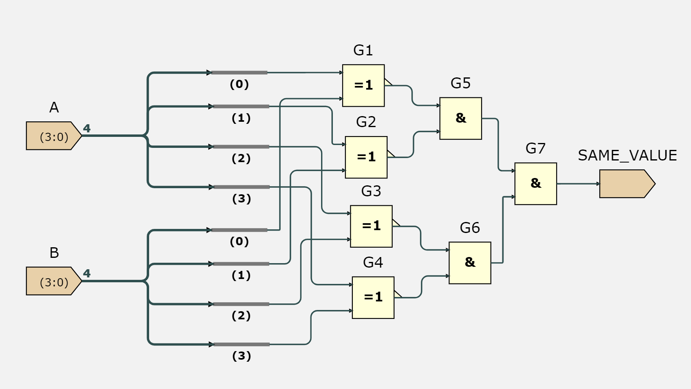

# Advanced ISSIE Vending Machine Project

This project demonstrates the design and implementation of an advanced vending machine using **ISSIE**, a digital circuit simulator. The project builds on basic vending machine principles, integrating custom logic circuits, state machines, and synchronous ROM to handle real-world vending scenarios like balance tracking, price fetching, and change return.

---

## **Project Overview**

The vending machine is designed to:
- Track inserted coins and calculate the balance.
- Fetch prices from a synchronous ROM.
- Match the balance with the price using comparator circuits.
- Provide accurate change when the balance exceeds the price.
- Integrate LED indicators and motor control for user feedback.

---

## **Key Features and Components**

### 1. **System Flowchart**
The flowchart outlines the logical flow of the vending machine, from coin insertion to item dispensing and change calculation.


---

### 2. **System Hierarchy**
This diagram shows the hierarchical structure of the vending machine, including ROM, comparator, remainder logic, and state transitions.


---

### 3. **2 bit bus separator Circuit**
Used to split a 2 bit input into 2 individual bits in 2 outpus 
.


---

### 4. **Flow Node N1 and N2**
Represents a specific logic node within the vending machine's operation.

N1


N2


---

### 5. **Next State Logic**
Handles state transitions based on current inputs, ensuring smooth progression through the machine's operation.


---

### 6. **Output Control**
Manages outputs such as LEDs (`LEDC` and `LEDS`) and the motor (`M`) for item dispensing.


---

### 7. **Challenge Implementation**
The integration of subsystems into the vending machine to meet the project's specific challenges and objectives.


---

### 8. **Half adder logic**
A complete hierarchical view of the vending machine system, showing all modules and subsystems.


---

### 9. **Full Adder Logic**
The full adder facilitates bitwise addition within the balance tracking system.


---

### 10. **4-Bit Full Adder**
This circuit is an expanded version of the full adder, used for 4-bit operations within the system.


---

### 11. **carry inverter circuit**
Inverts all bits in a 4 bit number by XORing each individual bit with a 1.


---

### 12. **Subtraction Logic**
This circuit computes the remainder (change) when the balance exceeds the price of the selected item.


---

### 13. **XOR Logic**
The XOR logic facilitates comparison between inputs, such as balance and price, by evaluating bitwise differences.


---

### 14. **Comparator Logic**
Determines whether the balance is greater than, less than, or equal to the price.


---

### 15. **Price Selection Circuit**
The ROM price selector fetches prices for items based on the user's selection.


	**ROM Content**
This table represents the contents of the ROM, mapping item numbers to their prices.


---

### 16. **Remainder Logic**
Calculates the remainder to be returned as change after a transaction.


---

### 17. **Same value checker**
Checks if 2 inputs have the same value (used to check if vending machine food selection input is 0000 to check weather or not food has been selected)



---

### 18. **High-Level Right Balance Logic**
A high-level integration of the balance logic with comparator and remainder circuits.


---

### 19. **Adder Circuit**
Used to calculate the total balance by summing the previous balance with the value of the inserted coin.


---

### 20. **Right Balance Logic**
Ensures the balance and price are matched accurately during transactions.


---

### 21. **Final Project Overview**
A high-level overview of the vending machine's operation. (Replaced previous duplicate with this unique summary image.)


# Install and Use Guide

This guide explains how to set up and use the project.

## Installation Steps

1. **Fork and Download the Repository**  
   - Fork this GitHub repository to your account.
   - Clone the forked repository to your local machine using the command:
     ```bash
     git clone https://github.com/your-username/repository-name.git
     ```
   - Navigate to the cloned repository directory and create a folder:
     ```
     ISSIE_Vending_dgm/Vending_Machine_ISSIE
     ```
   - Move all project files into this folder.

2. **Install ISSIE**  
   - Download ISSIE software from [ISSIE v5.2.1 Release](https://github.com/tomcl/issie/releases/tag/v5.2.1).  
   - Follow the installation instructions provided on the ISSIE repository page.

3. **Open the Project in ISSIE**  
   - Launch ISSIE on your system.  
   - Select **Open Project** from the ISSIE interface.  
   - Navigate to the folder where you downloaded the repository.  
   - Open the file:
     ```
     Vending_Machine.dprj
     ```

## Usage

- Once the project is loaded in ISSIE, you can simulate and modify the Vending Machine design according to your needs.

## Contributing

- For questions or to contribute to the project, raise an issue or submit a pull request.


---
---


# Vending Machine Project - Enhanced State Machine with Money Tracking

This project simulates a **vending machine** using a **state machine** design, implemented in ISSIE. The machine tracks state transitions, monitors input money, calculates balances, and handles item selection. It is split into two parts: the **Challenge Part** and a more **Advanced Extension**.

---

## **Challenge Part: Basic Vending Machine State Machine**

The challenge focused on designing a **simple state machine** with four states and corresponding outputs. 

### **State Machine Overview**
The vending machine operates in four states:
1. **Start (00):** Waiting for input (coin or selection).
2. **W/Coin (01):** Waiting for a coin to be inserted.
3. **W/Sel (10):** Waiting for a selection.
4. **VEND (11):** Dispensing the product.

### **Outputs**
- **LED-S:** Indicates the "Start" state.
- **LED-C:** Indicates that a coin has been inserted.
- **M:** Activates the motor to dispense the item.

### **How It Works**
1. The vending machine transitions between states based on input values (`I1`, `I2`) and outputs (`N1`, `N2`) using **Karnaugh maps** for simplification.
2. A **D-Multiplexer** determines which output (LED-S, LED-C, or M) should activate based on the current state.
3. The design ensures smooth transitions between states and simulates proper functionality using step simulations in ISSIE.

### **Advanced Feature: Vending Detection**
A **vending detection mechanism** was added:
- **If vending is in progress (`V = 0`):** The state machine remains in `VEND (11)`.
- **If vending completes (`V = 1`):** The state transitions back to `Start (00)`.

This addition made the state machine more robust and realistic, enabling it to properly handle vending scenarios.

---

## **Advanced Extension: Adding Money and Pricing Features**

To make the vending machine more like a real-world system, **money tracking** and **item pricing** were integrated.

### **Key Features**
1. **Item Pricing:**
   - A **ROM (Read-Only Memory)** stores the price of each item.
   - The price for each item can be retrieved using the item's selection input (`Food_Select`).

2. **Balance Calculation:**
   - A custom-designed **coin balance circuit** tracks the total money inserted into the machine.
   - Uses:
     - **Registers** to store balances.
     - A **4-bit adder** for summing input coins with the current balance.

3. **Price Comparison:**
   - A **custom comparator** checks if the total balance meets or exceeds the item's price.
   - If the balance matches or exceeds the price, the vending machine proceeds to dispense the item.

4. **Remainder Logic:**
   - Calculates the remaining balance after the purchase.
   - Provides a refund (`Give_Back`) if the balance exceeds the item's price.

---

### **How It Works**
1. **Initial Setup:**
   - Users select an item using the **Food_Select** input.
   - The machine retrieves the item's price from the ROM.

2. **Adding Money:**
   - Users insert coins using the **Coin_Value** input.
   - The total balance updates dynamically and is compared against the item's price.

3. **Making a Purchase:**
   - Once the balance meets or exceeds the item's price, the machine transitions to the **VEND (11)** state.
   - The motor (`M`) activates to dispense the item.
   - Any remaining balance is refunded (`Give_Back`).

4. **Changing Items:**
   - Users can change their selection at any time.
   - The machine dynamically adjusts the price and balance tracking for the new item.

---

### **Final Circuit Design**
The final vending machine integrates:
- **Inputs:**
  - `Food_Select`: Item selection.
  - `Coin_Value`: Value of inserted coins.
- **Outputs:**
  - `LEDC, LEDS, M`: Indicate the current state.
  - `Current_Balance`: Tracks the total money inserted.
  - `Price`: Displays the item's price.
  - `Remainder`: Shows the remaining balance.
  - `Give_Back`: Refund amount after a purchase.
- **Logic Blocks:**
  - **State Machine:** Manages transitions between states.
  - **ROM:** Stores item prices.
  - **Comparator:** Compares the balance with the item's price.
  - **Adder/Subtractor Logic:** Tracks and calculates the balance and remainder.

---

### **Simulation Results**
Step simulations confirmed the functionality:
1. **Coin Input and Balance Tracking:**
   - Added 3 coins → Balance: 3 (Remainder = 0 since 3 < Price).
   - Added 2 more coins → Balance: 5 (Price matched, item dispensed).
2. **Refunds:**
   - Added 1 extra coin → Balance reset to 0, `Give_Back = 1`.
3. **Item Selection:**
   - Changed item → Updated price from ROM.
   - Verified correct balance comparison and dispensing behavior.

---

### **Key Improvements**
1. Realistic pricing and balance tracking using a **ROM** and **custom comparator.**
2. Dynamic handling of state transitions, allowing:
   - Money to be added before selecting an item.
   - Seamless state changes during item selection and coin insertion.
3. Refund functionality when the inserted money exceeds the item's price.

---

## **Conclusion**
The vending machine now operates as a fully functional simulation with features resembling a real-world vending machine. It can:
- Track and compare inserted money with the item's price.
- Dispense items only when the required balance is met.
- Refund excess money after purchases.
- Dynamically adjust for item selection changes.

This project demonstrates:
- The application of **state machines** to real-world systems.
- Advanced logic design using ISSIE tools.
- The integration of additional components like **ROM**, **custom comparators**, and **adder circuits**.

